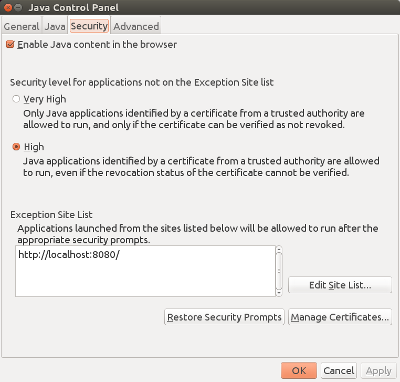

# Renjin Web Start Integration Test

This is a project to test Renjin in a Web Start environment.

## Setup and Build

First, you will need to add `localhost` to your Java Exception Site List to ensure that the unsigned 
Web Application is allowed to run at all.

From your shell, you can run `ControlPanel` and then navigate to the "Security Tab":

Then build the web applicaton by running:

   mvn clean install
   
## Testing

Change to the web application directory and start Jetty:

   cd webapp
   mvn jetty:run-war
   
You can now navigate to http://localhost:8080 and click the Start link.

